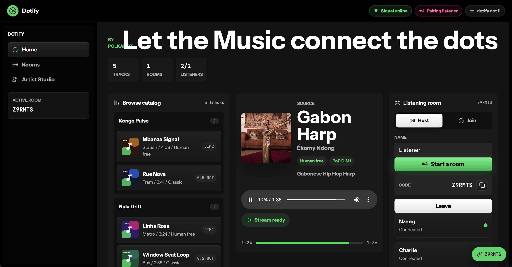

# Dotify

**Let the Music connect the dots.**

Dotify is a decentralized, cultural social hub, aimed to incentivise direct human connection through real time music listening. Each user can eitheir use it as a normal spotify app, or decide to host an epehemeral sound session, and invite other listeners join the same real-time feed.
By uploading their tracks on `Dotify`, artists provide their explicit consent to make use of their art as an instrument of "humanificiation", while retaining full control of their productions. Dotify offers them a dedicated dashboard to manage their catalog, rights and monetization, without any intermediary and in real time.



## What it does

- **Home**: artist-grouped music discovery, track artwork, descriptions, access
  mode badges, a player, and room-hosting controls.
- **Rooms**: open listening rooms plus manual room-code entry.
- **Artist Studio**: audio upload, cover image upload, description, rights
  metadata, music accessibility mode selection, and management of a smart `Music rights registry`.

## Path chosen

**Backend**: EVM smart contract (`MusicRightsRegistry`) on (Paseo Asset Hub).

**Frontend**: Static React + Vite web app deployed to dot.li.

**WebRTC**: Realtime music streaming

**Socket.io**: Signaling // TODO -> Use the statement store

## Deployed

**EVM contract** — `0x17623c6df0e9cb06bf64364588ebb057b0ea43c6` (Paseo Asset Hub, chainId 420420417)

**Bulletin CID** — `bafkr4ibynaanfrddyjgpmut2qrcu6vdttocbp4feyw6vkgxkkhqndjksny`

**Gateway URL** — <https://paseo-ipfs.polkadot.io/ipfs/bafkr4ibynaanfrddyjgpmut2qrcu6vdttocbp4feyw6vkgxkkhqndjksny>

**DotNS name** — `dotify.dot.li`

## How to run end-to-end (locally)

**Prerequisites**: Node 22, npm 10+.

```bash
cd web
npm install
npm run dev:listen
```

Open the app in a browser at `http://localhost:5273`.

Default ports:

| Service       | URL                                              |
| ------------- | ------------------------------------------------ |
| Frontend      | <http://localhost:5273>                          |
| Signaling     | <http://localhost:8788>                          |
| Bulletin RPC  | `wss://paseo-bulletin-rpc.polkadot.io`           |
| Asset Hub RPC | <https://services.polkadothub-rpc.com/testnet>   |

The app talks to Paseo Bulletin and Asset Hub directly from the browser. A local
Ethereum node or local Substrate node is not required to run the demo.

**To rebuild and redeploy the frontend to Bulletin Chain:**

```bash
cd web
npm run build:bulletin   # produces dist-bulletin/index.html (~1 MB single file)
npm run deploy:bulletin  # uploads to Bulletin via Alice dev account
```

Alice must hold upload authorization on Paseo Bulletin. Update `deployments.json`
with the new CID printed by the deploy script, then register the CID with DotNS.

## Track model

Each uploaded track gets:

- a blake2b-256 content hash of the audio file;
- blob URLs for audio and cover held in memory for the session;
- a JSON rights manifest published to Bulletin Chain;
- an EVM NFT minted by `MusicRightsRegistry` with the content hash, metadata
  reference, royalty splits, and access mode.

Track data is in-session only: closing the tab loses the audio and cover. The
on-chain record (NFT + Bulletin manifest) persists.

## Access modes

- **Human free**: free listening for addresses with Polkadot Proof of Personhood
  (DIM1 or DIM2). The contract gates NFT transfer to the same level.
- **Classic**: paid access in DOT. The contract records the price and distributes
  payments to configured royalty recipients on `purchaseAccess`.

Proof of Personhood is a registrar-controlled mapping in the contract — ready
for a live Individuality chain integration without blocking the prototype.

## What works

- WebRTC host-to-listener audio stream (tested with two local browser tabs and
  across LAN).
- Socket.IO signaling with open-room discovery and manual room codes.
- Artist Studio: audio upload, cover image upload, blake2b hash, Bulletin Chain
  manifest upload, EVM contract registration (mint + royalty splits).
- Seed catalog with five tracks browsable on the Home view.
- `MusicRightsRegistry` contract: mint, `canAccess`, `purchaseAccess`, royalty
  distribution, `ownerOf`, transfer gating by personhood level.

## What doesn't work / known limitations

- **Audio is session-only**: blob URLs are revoked on unmount. Reloading the page
  loses the uploaded audio; the on-chain record remains but playback is broken.
  A pinning backend (IPFS or equivalent) is needed for durable storage. (ideally Bullet chain when storage capacity will be higher)

- **No real wallet**: signing uses hardcoded dev accounts (Alice for Bulletin,
  Alice EVM account for contract calls). A real signer integration using Pwallet is on the migration list.
- **Proof of Personhood is mocked**: `setPersonhoodLevel` is a dev-only admin
  call. Live Individuality chain reads are on the roadmap.
- **No IPFS pinning backend**: `VITE_IPFS_UPLOAD_URL` is unset. Tracks with
  `pending-*` audio refs cannot stream to remote listeners.

- **Single-host rooms**: no multi-host or handoff logic. If the host closes the
  tab, the room ends.

## Architecture

```text
Browser (React + Vite)
  ├── WebRTC audio stream (captureStream → RTCPeerConnection per listener)
  ├── Socket.IO  →  Node signaling server  (SDP/ICE only)
  ├── polkadot-api (PAPI)  →  Paseo Bulletin Chain  (manifest upload)
  └── viem  →  Paseo Asset Hub EVM  (MusicRightsRegistry)
```

The frontend is built as a single self-contained HTML file using
`vite-plugin-singlefile` so it works when served from a flat IPFS CID.

## Rights contract

`contracts/evm/contracts/MusicRightsRegistry.sol` handles:

- one active track record per content hash (prevents duplicate registration);
- NFT mint with `ownerOf`, `balanceOf`, and transfer events;
- cover, audio, metadata, and Bulletin manifest references stored on-chain;
- Human free or Classic access mode with PoP gating;
- DOT payment and royalty distribution on `purchaseAccess`.

## Structure

| Path             | Role                                                     |
| ---------------- | -------------------------------------------------------- |
| `web/`           | React app, signaling server, Bulletin deploy scripts     |
| `web/.papi/`     | PAPI descriptors for Bulletin Chain                      |
| `contracts/evm/` | Hardhat + Solidity `MusicRightsRegistry`                 |
| `docs/`          | Stack alignment notes                                    |
| `deployments.json` | EVM address + Bulletin CID (source of truth)           |