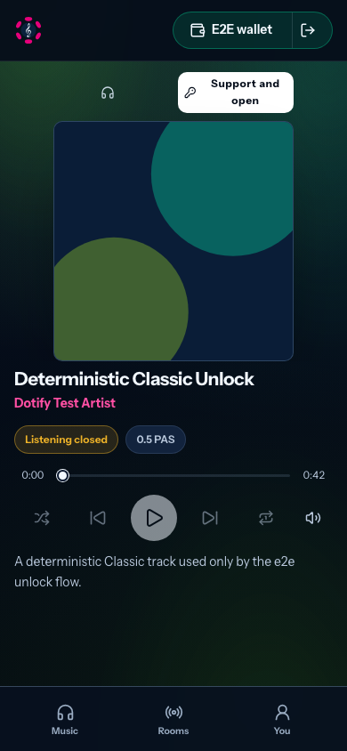
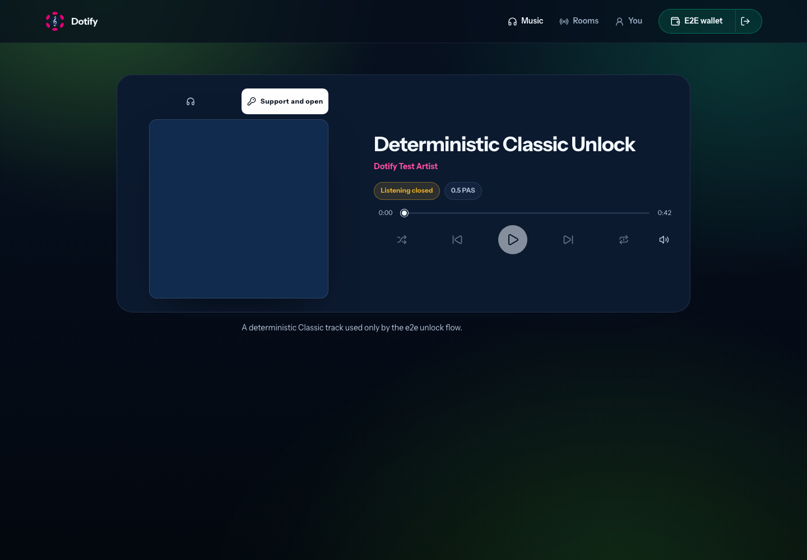
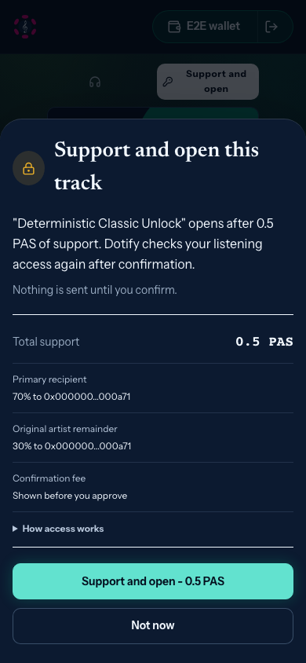
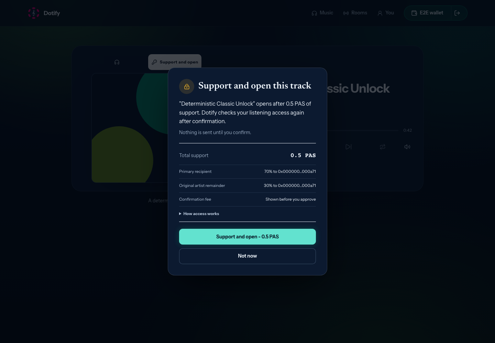
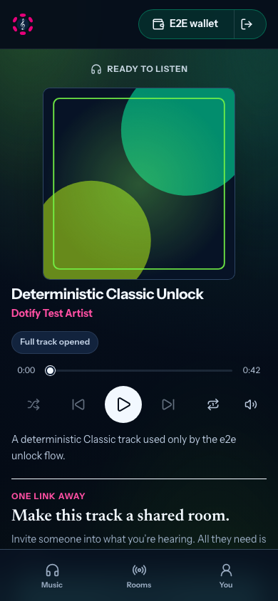
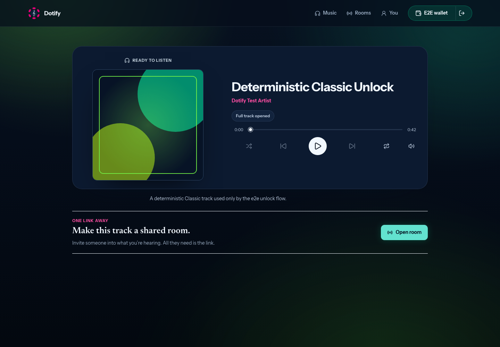

# W23 — evidence and handoff

## Identity

- Sequence and scope: W23, keep the solo player immersive and make artist support plain.
- Date: 2026-09-17.
- Starting dev SHA: `20b37593bd1cdd2fcb193abc954680d20413cacf` (merged W22 / PR #185).
- Implementation SHA actually tested: `20c42930c7aa5be20ce9ce76233c8c160f798dd3`.
- Branch / PR / issue: `fix/player-support-clarity`; [PR #186](https://github.com/knzeng-e/dotify/pull/186); [issue #178](https://github.com/knzeng-e/dotify/issues/178).
- Related dependency evidence: [W04](W04.md), [W12](W12.md), and [W22](W22.md).
- Code readiness: locally verified; PR CI passed at `b43ed9250caed468a921f0a61dff12cae4f2898f`.
- Release readiness: not deployed.

## Result and decisions

The solo player is now one bounded listening surface. Its status and access cues
sit with the track, the release description follows the player, and the old
`Listening room` / `Current track` dashboard tail is absent in solo mode. The
room invitation appears only after the selected release has a usable audio
source and access is open.

Opening a protected release no longer interrupts browsing with a dialog. The
listener explicitly chooses `Support and open`; only then does Dotify show the
amount, asset, recipients, confirmation fee, and the guarantee that nothing is
sent before confirmation. Secondary access conditions are available under an
on-demand disclosure. A long mobile receipt initially focused its bottom action
and therefore opened already scrolled; `Dialog` now supports top-level initial
focus and the access summary uses it.

Wallet prompts carry the initiating intent (`account`, `support`, or `artist`).
The support path explains why an account is needed and what will be reviewed.
`Use browser wallet` replaces the primary `Use EVM wallet` label; EVM is retained
only in collapsed technical details. Payment execution, receipt recovery,
runtime read-back, content-key delivery, and contract behavior are unchanged.

During the expanded browser run, an intermediate implementation treated the
mere presence of a socket emitter as room intent, reopening the solo dialog.
The final implementation passes an explicit `showAccessGateOnDenied` intent
only for host room selections and for the confirmed create-room path.

The first PR CI run also found stale catalog expectations for the retired
automatic dialog and a real Product Mobile regression: hiding the solo
dashboard tail hid its required `Open Dotify in browser` recovery action. The
expectations now assert the explicit player CTA, while the recovery error and
action live beside the solo player and remain visible without restoring the
old dashboard panels.

## Verification

| Command or real scenario | Environment and build | Observed result | Artifact |
| --- | --- | --- | --- |
| `npm --prefix web run test:unit` | Local macOS, Node 22.13.1, deterministic fixtures | Passed: 66 files, 529 tests. | Terminal output |
| `npm --prefix web run test:e2e -- classic-unlock.spec.ts room-workspace.spec.ts` | Chromium, local Vite + signaling servers | Passed: 29 tests. Covers happy support, rejection, delayed confirmation, paid-without-access, mobile receipt top focus, explicit solo intent, and protected host lineup selection. | Terminal output |
| `npm --prefix web run test:e2e -- classic-unlock.spec.ts` | Chromium, final diff after solo-tail CSS cleanup | Passed: 7 tests. | Terminal output |
| `npm --prefix web run test:e2e -- classic-unlock.spec.ts artist-gift.spec.ts` | Chromium, deterministic payment and donation ports | Passed: 11 tests. Gift remains separate from listening access and recovery does not send twice. | Terminal output |
| `npx playwright test e2e/clear-interface.spec.ts e2e/catalog-journey.spec.ts e2e/room-join.spec.ts --workers=2` | Chromium, local Vite + signaling servers, final CI follow-up | Passed: 21 tests. Covers explicit locked-track support intent, catalog focus/context restoration, room audio, and visible Product Mobile browser handoff. | Terminal output |
| `npx playwright test --config playwright.product-identity.config.ts` | Chromium + WebKit, local Product identity fixtures | Initial sandbox run could not bind `127.0.0.1:8789` (`EPERM`); approved localhost rerun passed 10 tests. | Terminal output |
| `npm --prefix web run build` | Vite production build | Passed. Existing large-chunk and mixed static/dynamic import warnings remain. | Terminal output |
| `npm --prefix web run build:product-devnet` | Product DevNet Vite build | Passed. Catalog bootstrap refresh could not reach the network and retained the checked-in snapshot. | Terminal output |
| `npm --prefix web run lint` | ESLint | Passed with 0 errors and 3 existing hook dependency warnings in `App.tsx` and `ArtistShell.tsx`. | Terminal output |
| `npm --prefix web run fmt:check` | Prettier | Passed. | Terminal output |
| `node scripts/backlog-sync.mjs --check --offline`; `git diff --check` | Repository root | Passed. Existing backlog warnings remain for active item 24 mapping and duplicate 08 documents. | Terminal output |
| Visual review at 390×844 and 1440×1000 | Chromium, deterministic Classic release | Player, locked state, support review, and opened state inspected. No horizontal overflow or receipt-row overlap observed. | Captures below |

The expanded five-spec development run exposed the socket-intent regression
after 40 unrelated tests had passed; it was interrupted once the repeated
Classic failures identified the same cause. The explicit-intent fix was then
validated by the final 29-test combined run above.

### Visual evidence

Before references from the audit:
[solo dashboard tail](../../../design/images/ux-design-audit-2026-09-17/player-dashboard-panels-1440.jpg),
[automatic support dialog](../../../design/images/ux-design-audit-2026-09-17/support-dialog-1440.jpg), and
[generic mobile wallet sheet](../../../design/images/ux-design-audit-2026-09-17/wallet-sheet-390.jpg).

| State | 390 px | 1440 px |
| --- | --- | --- |
| Protected release, explicit support CTA |  |  |
| Amount and recipients before confirmation |  |  |
| Verified access and eligible room invitation |  |  |

## Compatibility and operations

- Supported devices, browsers, and Product host versions: local Chromium and WebKit fixtures were run. A physical iPhone/iOS 16 device and a real Product host were not available.
- New config/permissions and documented defaults: none.
- Storage/key/contract migration and compatibility evidence: none; no persistence, key, ABI, or contract behavior changed.
- Deployment identifiers: not deployed.
- Rollback: revert the W23 PR; no live migration or settlement action is involved.
- Data collected, retention, and user controls: no new telemetry or persistence. Wallet intent exists only in React UI state and resets on a new explicit entry point.

## Acceptance mapping

| Sequence criterion | Passed / failed / not run | Supporting evidence or exact blocker |
| --- | --- | --- |
| Classic happy, rejected, delayed, and paid-without-access outcomes plus gift recovery pass. | Passed | Final Classic 7/7, combined Classic/room 29/29, and Classic/gift 11/11 runs. |
| A payment record never renders as playable access; retries cannot charge twice. | Passed | `classic-unlock.spec.ts`, `artist-gift.spec.ts`, and payment read-back unit tests. |
| Amount and recipients appear before confirmation; nothing is sent before confirmation remains visible. | Passed | Access-gate assertions and 390/1440 support-review captures. |
| Primary listener copy avoids runtime, registry, chain, and EVM vocabulary. | Passed | Access-promise unit assertion; EVM appears only inside collapsed technical details. |
| Web and Product builds succeed. | Passed | Both builds completed; Product bootstrap used the checked-in snapshot after a network failure. |
| Real Product host and physical mobile validation. | Not run | Requires a compatible Product host and physical device; no claim is inferred from fixture builds. |

## Remaining gates

- Recheck the support sheet and account continuation on the owner’s physical iPhone/iOS 16 device.
- Run one real Product-host support attempt and one browser-wallet attempt against the deployed candidate before calling the flow live-verified.
- The Product catalog bootstrap refresh remains dependent on network availability; this run verified the checked-in fallback only.

## Next agent

- Next eligible sequence after W23 merges: W25 (`fix/artist-workspace-language`), followed by W24 visual-system consolidation.
- Inspect `PlayerView.tsx`, `AccessGateOverlay.tsx`, `accessPromise.ts`, `WalletModal.tsx`, `Dialog.tsx`, and `UiFeedbackProvider.tsx` before changing support language or overlay behavior.
- Preserve explicit support intent, visible amount/recipients, top-focused long dialogs, payment/access separation, and room-only access-gate intent.
- Reproduce the key flow with `npm --prefix web run test:e2e -- classic-unlock.spec.ts room-workspace.spec.ts`.
- Project/metadata updates: PR #186 and issue #178 are in Project 5; P1, Design record, Next, Work, and the W23 backlog path are mirrored on the PR. Both items are In Review and the PR is ready for review.
