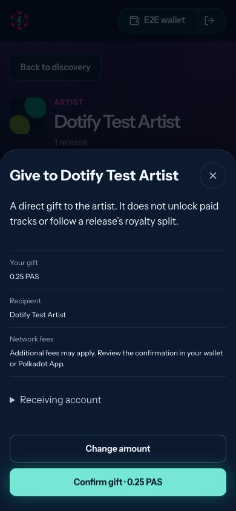
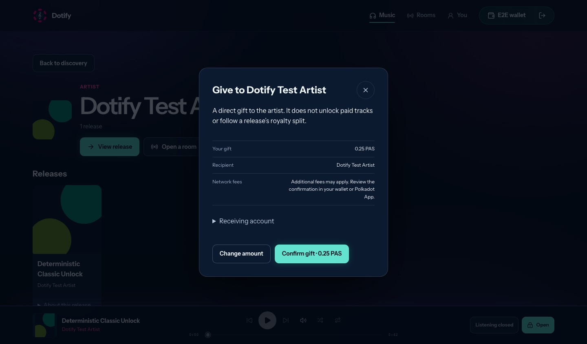

# Artist support recovery and direct gifts — evidence

- Reviewed base: `dev` at `ee695caeaf18f4ce52f5ea71f48b8204d909162b`.
- Tested implementation: `9bd6fea8060a04a63bc8ee6133c4f988b858fb2a`.
- Branch: `fix/product-host-support`. Refs #156 (W12), #85 (W11).
- Code ready for review; native release acceptance remains open. No deployment,
  contract change, real signature or transfer was performed.

## Delivered

Recoverable Classic support now reserves an attempt before approval, preserves
its reference/amount across reload, and checks fresh access before full playback.
Unknown outcomes cannot automatically pay again. Read-only recovery does not
require a payment signer. Product payments explicitly await finalization;
failed writer initialization can be retried. Receipt amounts use integer runtime
prices and retain the original requested amount during recovery.

An optional direct gift form re-reads the release artist, reviews an exact chosen
amount, then uses the connected EVM wallet or verified Product native signer.
Native gifts resolve the original account and use native currency precision.
A gift never unlocks a track or applies a royalty split. Gift recovery is
independent of access recovery. Polkadot App gifts and native Classic support
remain behind the explicit support build; gifts are off in ordinary builds.

Design and operating boundaries:
[support recovery](../../../design/product-host-support-recovery-2026-09-15.md),
[direct gifts](../../../design/artist-gifts-2026-09-16.md).

## Verification

macOS local, Node 22.13.1, shared installed dependency tree. CI performs a clean
`npm ci` and independently verifies the lockfile; local code did not replace the
user's original dependency tree or regenerate their catalog bootstrap.

| Command / check | Observed result |
| --- | --- |
| `npm --prefix web run test:unit` | 512 tests, 64 files passed. Includes 18 purchase recovery and 34 gift tests. |
| `npx playwright test --workers=2` in web | 79 Chromium scenarios passed, including real local WebRTC room/audio continuity. |
| `npx playwright test e2e/artist-gift.spec.ts e2e/classic-unlock.spec.ts --workers=2` | Final 11 purchase/gift scenarios passed after the Safari focus and deterministic RPC-fixture corrections. |
| `npx playwright test --config playwright.support-webkit.config.ts --workers=2` | Final 11 WebKit scenarios passed at mobile and desktop sizes. |
| `npm --prefix web run lint` / `fmt:check` | Passed; three existing hook dependency warnings in App.tsx/ArtistShell.tsx. |
| `npm --prefix web run build` | Passed, including TypeScript. Existing annotation/mixed-import/large-chunk warnings remain. |
| `VITE_DOTIFY_RUNTIME_ADAPTER=product-cdm VITE_DOTIFY_ARTIST_DONATIONS=on npx vite build --config vite.product.config.ts --mode product-devnet` | Passed; real Product transaction API/descriptors bundled. Build only, using existing catalog snapshot. |
| `npm --prefix web run smoke:production-env` | Missing endpoints and browser secrets rejected; safe public environment builds. |
| `node scripts/backlog-sync.mjs --check --offline` / `git diff --check` | Passed; existing 24 unmapped backlog items and duplicate numbered 08 documents remain warnings. |

Safari initially exposed a pointer-focus return issue after closing the gift.
The opening button now explicitly establishes the dialog's return focus target.
A later Classic fixture hit public RPC HTTP 429 on `eth_chainId`; that external
read is now stubbed in the browser test while the real coordinator remains in
use. Neither failure was suppressed by weakening an assertion.

## Visual inspection

Reviewed the mobile gift review, desktop gift review, and mobile recovery receipt.
The gift confirmation fits at 390×844; long support receipts use the existing
scrollable dialog. These are browser screenshots, not a physical keyboard test.

[Support recovery](../../../design/assets/artist-support/support-recovery-390.jpg)
and [gift recovery](../../../design/assets/artist-support/gift-recovery-390.jpg).

## Unfinished acceptance / next step

- Physical iPhone/Polkadot App approval, value forwarding, final native receipt,
  exact native gift recipient/amount and protected-key opening are **not run**.
  Follow the two design documents with the actual build SHA and host version.
- A native submission interrupted before a hash is returned requires inspection
  in host activity; the app conservatively keeps its reservation. Direct gifts
  have no cross-tab/device idempotency guarantee. Do not clear unresolved
  references or resend elsewhere without checking activity.
- Artist profiles still group by display name. Each gift instead identifies the
  exact canonical lead release and its registered artist account.
- CASH, fiat, subscriptions and contract changes are out of scope. Feature rollback
  is a rebuild without the gift flag; keep native CDM opt-in until device proof.
- Keyboard/compositor changes are independently reviewed in PR #171. This branch
  has no dependency on that PR and does not claim physical iOS validation.
