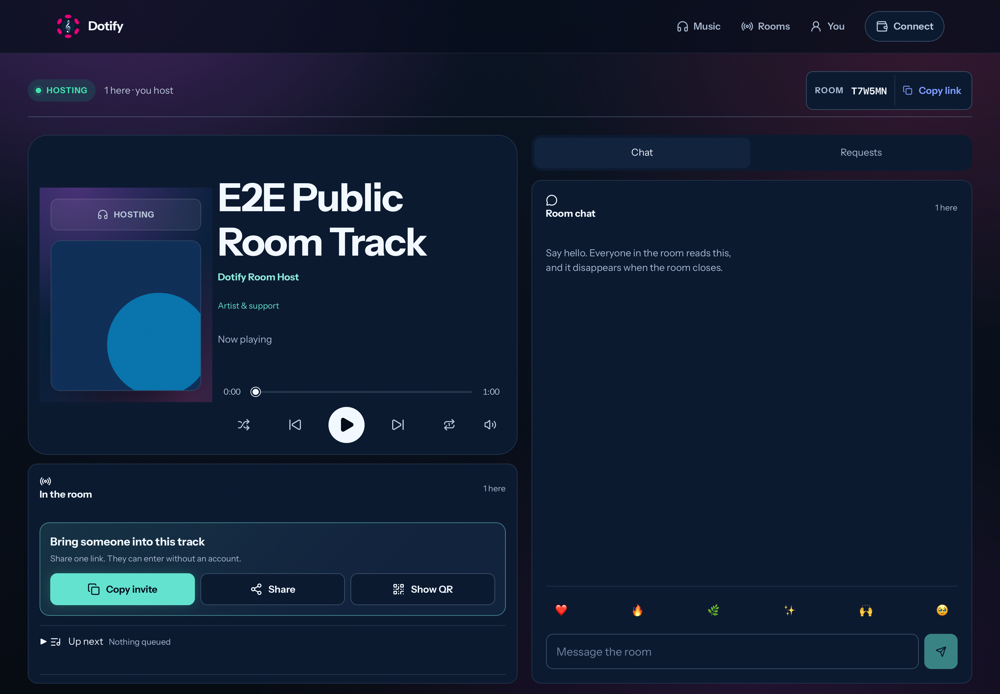
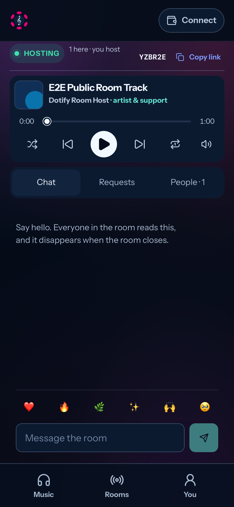

# Mobile host playback and color parity

## Scope and status

Refs #89; targeted follow-up to [W09](../W09-room-resilience.md) and the
[visual contract](../../../design/visual-system-contract.md).

Base: tested `dev` at `69e8ef8de49e5fdf764e8281fdd156b4be3d3c2d`.
Implementation: `cdfad8f7f6e3d8dcf5e030e16442f1c94300874b` (including
`505c47a29b01fd3d4383e838318b2598d1df3f0f`). Product candidate: `[0, 1, 29]`.

The user reports repeating audio after Pause/Next and Play resuming the wrong
track in Product Mobile, plus colors differing from desktop. The implementation
and browser regressions are complete. Physical Product host verification is
still required: no device/OS/host version or accessible recording was available
for this run. This is not a claim that the device-specific bug is proven fixed.
No deployment, transaction, contract upgrade, or migration was performed.

## Findings and design

The media element's pause state previously disabled the room stream but did not
gate the Web Audio speaker path. A decoder producing residual frames could
therefore still reach the local output. Outgoing elements also retained their
source and graph until a later capture completed. Source replacement rearmed
autoplay without preserving an explicit pause.

- `hostAudioOutput.ts` binds output callbacks to one media element using a
  WeakMap. Pause silences before pausing; explicit Play resumes its AudioContext
  within the gesture; retirement removes its source and releases the graph.
- `useSession.ts` inserts a playback gain before both the outgoing stream and
  local monitor. Pause, seek, end, or insufficient readiness gates both paths;
  local mute/volume still only affects the monitor.
- `useCatalog.ts` retires the outgoing element before asynchronous access work
  and transfers pending readiness to a materialized replacement URL.
- `usePlayback.ts` retains user pause intent across transport/source changes.
  Startup events and promises must still own the current media generation.
- `PersistentAudio.tsx` retires replaced nodes at ref detachment. Explicit
  catalog selection still requests playback through `PlaybackProvider`.
- The mobile fixed room shell keeps its opaque keyboard-safe canvas, uses the
  desktop `--listening-background`, and contains its aura below the controls.
  System light/dark preference does not change the Dotify palette.

No access, payment, key, signing, or guest-join authority changes. Guests still
receive the ephemeral host stream without obtaining content keys. The fix adds
no dependency, credential, persistent schema, or host permission.

## Validation

| Command or evidence | Result and boundary |
| --- | --- |
| `npm --prefix web run test:unit` | 77 files, 608 tests passed. |
| `npm --prefix web run test:e2e -- --workers=2` | 124 passed, including real Web Audio room synchronization, source-generation races, guest recovery, and keyboard geometry. |
| From `web`: `npx playwright test --config playwright.mobile-host.config.ts --workers=2` | 6 passed across Chromium and WebKit iPhone 13 emulation; no autoplay-enabling browser flags. |
| `npm --prefix web run build` | Passed. |
| `npm --prefix web run build:product-devnet:frozen` | Passed without refreshing the catalog fixture or publishing. |
| `npm --prefix web run lint` | Zero errors; three existing hook dependency warnings in App and ArtistShell. |
| `npm --prefix web run fmt:check` | Passed. |
| `node scripts/backlog-sync.mjs --check --offline` | Passed. |
| `git diff --check origin/dev` | Passed. |

Builds retain the existing Rollup annotation, mixed dynamic/static import, and
large chunk warnings.

The audio regression measures the speaker branch with an analyser. It verifies
440 Hz playback, silence after pause, source removal/context closure after Next,
660 Hz playback after resuming a suspended context, and 440 Hz after Previous.
An injected oscillator simulates residual decoder frames; this is deliberately
synthetic fault injection, not a recording of the physical Product engine.

The baseline on `69e8ef8` failed that residual-signal pause assertion (RMS about
0.707 instead of below 0.0001) and the mobile backdrop comparison. The delayed
capture scenario already passed on the baseline and remains regression coverage.

The first full run found that removing mobile opacity broke the existing
keyboard transition invariant. The final solution shares the gradient while
retaining opacity; the full 124-test suite then passed without weakening that
keyboard assertion.

### Visual evidence

Same fixture track and reduced motion, at desktop 1440x1000 and mobile 390x844
CSS pixels. WebKit screenshots were inspected for color consistency, layout,
and overflow. Computed palette, effective canvas, gradients, aura, and Play
color match across viewports and both system color preferences. Responsive
composition intentionally differs; it is not a pixel-identical layout.

## Remaining physical-host acceptance

After review/merge, publish the frontend from clean tested dev using the normal
Product deployment runbook. Confirm executable version `[0, 1, 29]` and its CID,
then fully reopen the app. Do not reset the catalog or redeploy CDM/contracts.

1. Record phone model, OS, Polkadot App version, deployment SHA/CID, and network.
2. Host a room using a real track and join from another device.
3. Pause, wait, choose Next, wait, and press Play. Both outputs must remain
   silent while paused; the displayed and audible track must agree after Play.
4. Repeat with Previous and quick changes, including a protected authorized
   track, slow loading, and foreground/background return.
5. On the same track, compare desktop/mobile colors in system light and dark
   modes; open/dismiss the chat keyboard and confirm the controls stay usable.
6. Save the result/recording against this candidate; failures remain release
   blockers rather than being waived by emulation results.

Broader #89 acceptance (real relay/independent-network evidence, recovery,
quality metrics, and the mesh/SFU boundary) is not closed by this patch. W13
still owns pilot evidence. Rollback restores the prior frontend bundle and
executable metadata; no data rollback is required.
