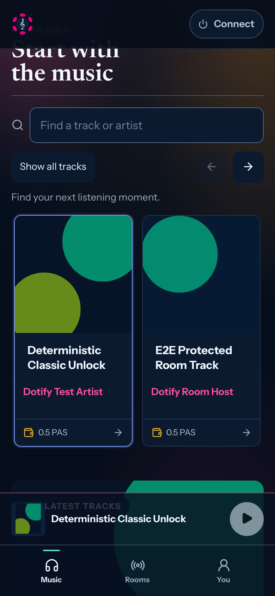
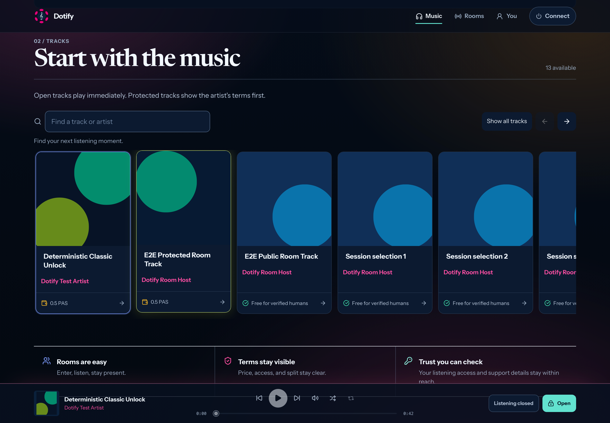

# Mobile composition and catalog discovery

Branch: `fix/mobile-composer-and-discovery`  
Reviewed base: `dev` at `6cdcd11a504aa602c0800bb4b28d91f286030493`  
Scope: partial [#90](https://github.com/knzeng-e/dotify/issues/90), following the
[product-readiness roadmap](../../polkadot-product-readiness-and-killer-dapp-roadmap.md)
and [room resilience sequence](../W09-room-resilience.md).

## Delivered behavior

A room enters a compact composition mode when its message or track-request
field receives focus. The room player, current track, presence, panel tabs and
composer stay together; global navigation and secondary room actions temporarily
make space. **Done** dismisses editing. Draft ownership and the mounted audio
elements are unchanged. Desktop keeps its existing side-by-side room layout.

The home catalog is a horizontal row of cover-led tracks, with native touch and
trackpad scrolling, previous/next buttons, keyboard navigation, and an explicit
all-tracks grid. Search matches titles and artists regardless of letter case or
accents. Empty search results offer a clear reset. Opening a protected track
still goes through the existing access gate. Featured tracks advance only when
the listener chooses another item.

## Why the keyboard fix has two inputs

`useRoomViewport` uses **focus** to decide which controls are useful while
writing, and **VisualViewport** to size and position the available room. Focus
must not depend on an exact zoom factor or on the layout viewport remaining
unchanged: keyboards and browser chrome can resize those viewports differently.
The baseline-height comparison is normalized for zoom, so pinch zoom alone is
not mistaken for a keyboard. Room inputs have a minimum 16px font size.

Geometry updates are coalesced with animation frames. Three bounded follow-up
reads after focus changes cover delayed WebKit keyboard animation updates;
listeners and timers are removed when leaving the room. Button presses hold
the layout until release, so blur cannot move a tab before its click lands. There is no permanent
polling, global scrolling command, zoom restriction, or audio remount.

References: [VisualViewport API](https://developer.mozilla.org/en-US/docs/Web/API/VisualViewport),
[viewport concepts](https://developer.mozilla.org/en-US/docs/Web/CSS/Guides/CSSOM_view/Viewport_concepts),
and [WebKit delayed keyboard geometry report](https://bugs.webkit.org/show_bug.cgi?id=265578).
These explain the browser boundary; they do not prove behavior on the reporter's
physical phone.

## Validation and its limits

The regression scenarios cover focused chat with zoom and offset, and track
requests when both layout and visual viewport heights shrink. Both failed on
the original navigation visibility assertion and pass with the change. They
check visible input bounds, readable font size, draft retention, restored
navigation, and audio element identity. Catalog scenarios at 390px and 1440px
cover scrolling, keyboard bounds, search, grid switching, empty results and
protected-track access.

Run from `web/`:

```sh
npm run test:unit
npm run lint
npm run build
npx vite build --config vite.product.config.ts --mode product-devnet
npm run test:e2e
npx playwright install webkit
npx playwright test --config playwright.webkit.config.ts
```

The Product build command checks the existing catalog snapshot without
regenerating it. No deployment, server configuration, migration, or new package
is required. The WebKit config intentionally runs five layout regression
scenarios; real multi-peer audio remains covered by the Chromium suite.

Automated viewport geometry is synthetic. Desktop WebKit is not an iPhone
software keyboard. On this macOS 14 runner, Playwright supplies a frozen WebKit
build, so physical Safari remains an acceptance check: focus chat and requests,
write a long draft, send several messages, dismiss and reopen the keyboard,
rotate the phone, and repeat while receiving music from another device. Check
that the text, Send button, current track and latest messages remain usable.
Repeat with a hardware keyboard and accessibility text enlargement. Product
DevNet build success likewise does not replace a real Product-host smoke test.

### Recorded results, 2026-09-15

- Unit tests: **450 passed**, 59 files.
- Chromium: **45 passed**, two workers, full suite (1.7 minutes).
- Desktop WebKit: **5 passed**, including the press/release regression.
- ESLint, formatting, TypeScript, web build and Product DevNet build: passed.
- Backlog offline and whitespace checks: passed. Existing backlog mapping and
  duplicate-number warnings remain, as do build chunk-size and dependency
  annotation warnings.
- Visually inspected mobile/desktop catalog and compact chat/request captures.

The blur/click regression reproduced a roughly 127px tab movement before the
fix. The final full browser run was sequential with builds to avoid resource
contention; timeout limits were not relaxed. An old compact-list card-height
assertion was updated for the new cover-led row, retaining viewport and
navigation bounds checks.

## Durable follow-ups

- Retain discovery position and query when returning from a track or artist,
  using explicit navigation state with a clear reset. Current search stays
  local to the mounted catalog and creates no listening history.
- Add more editorial rows only with real curation data. Keep a complete,
  searchable catalog and stable track identities as the accessible path.
- Add a physical iPhone keyboard check to release acceptance. More synthetic
  viewport cases cannot establish Safari keyboard behavior on their own.
- For catalogs large enough to need pagination, make search and pagination share
  one authoritative catalog service. This pass filters the already loaded
  catalog; it does not claim to search music that has not been loaded.

The earlier #164 preview PR was merged into its feature base after #163 had
already been squashed into `dev`. Its shared-queue and nearby-preview changes
are therefore not part of this reviewed base; integrating them requires a
separate PR. This mobile fix does not depend on those experiments.

## Review captures

These are deterministic fixture tracks rendered by desktop WebKit, with
synthetic keyboard geometry. The blank area below the compact room represents
space outside the simulated visible viewport, not a captured iPhone keyboard.

| Mobile catalog | Desktop catalog |
| --- | --- |
|  |  |

| Chat with reduced visible height | Track request with both viewports resized |
| --- | --- |
|  |  |
