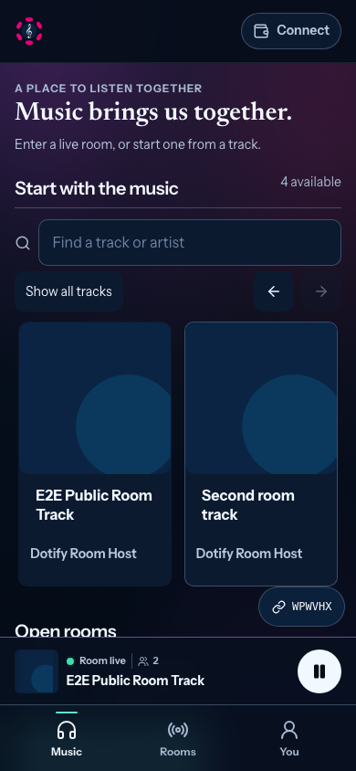
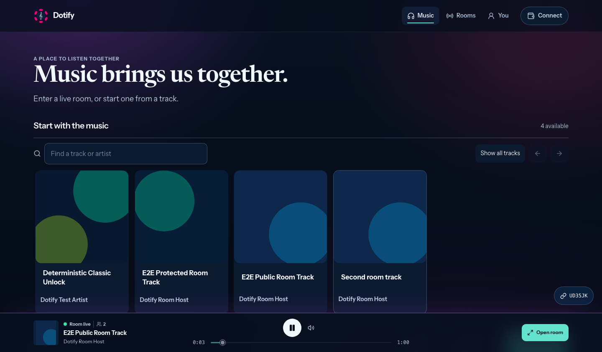

# Room dock metadata and live context — 2026-09-22

Pilot-reported correction under #90 / W22; this is not a new sprint or a
reopening of the delivered visual redesign. Base: `e6d1458e5a32a2357d2663520b71beabced88439`.
Branch: `fix/room-player-dock`.

## Observed failure and scope

A room listener returned to Music or Rooms. Audio correctly stayed on the
remote stream, but the dock preferred the last catalog selection over the
host's current metadata. It could therefore show another title, artist, cover,
and fallback duration, alongside disabled host-only actions.

The dock and full player now resolve their track through one role-aware helper:
listeners use only the room snapshot; local/host playback uses the selected
track. Missing room fields never fall back to an unrelated catalog track.
Leaving a room restores the local selection even while the last remote snapshot
remains in memory. Missing artwork uses the existing generated cover fallback.

A compact, actionable room indicator distinguishes `Room live` from `Hosting
live`, with the existing green pulse and a connection-based people count
including self and host. It opens the current room. Paused, blocked, syncing,
and reconnecting states have distinct text and no live pulse; reconnecting
hides potentially stale counts. Existing reduced-motion rules apply.

Room guests retain local listening and volume controls and the read-only host
clock. Skip/shuffle/repeat are absent, as in the full player. The room chat
header now reports the same live presence count, or `Reconnecting`.

## Boundaries

- No signaling protocol, WebRTC lifecycle, access/payment, storage, analytics,
  environment, deployment, or contract changes.
- Counts describe room connections, not verified humans or audible receivers.
- Socket online alone does not produce a live badge: playback status must also
  be playing. Audio status remains based on the existing playback controller.
- This is shared frontend presentation for browser and Product; physical
  Product Host and Safari validation remain part of W13.
- #90 stays open for its remaining pilot-backed wallet-later scope. The user's
  second playback report was cut off and needs its missing detail.

## Validation

- 14 focused unit tests: metadata authority, missing metadata, leaving a room,
  host/listener/live/degraded states, playback status and progress.
- 7 Playwright journeys: new room dock scenarios at 320, 390 and 1440 px plus
  the existing room-sync and room-continuity suites. Real local Socket.IO and
  WebRTC; deterministic catalog/audio fixtures, no real payment or content keys.
- Scenarios cover a different preceding solo track, Music/Rooms navigation,
  host Next, pause/resume, return to the full room, stable remote stream object,
  guest-only controls, host controls, presence changes, and leaving/restoring
  solo metadata.
- Web build, lint (three pre-existing hook warnings), formatting, and whitespace
  checks. Existing Rollup annotation/mixed-import/large-chunk warnings remain.
- Screenshots visually inspected at mobile and desktop widths; no horizontal
  overflow at 320, 390 or 1440 px.

## Review order

1. `playbackPresentation.ts` and its tests: room metadata is a complete snapshot,
   and mode changes switch the metadata authority with the transport.
2. `PlayerDock.tsx`, `ListenerShell.tsx`, `PlayerView.tsx`: props, controls,
   status, fallback artwork, navigation, and common track resolution.
3. `RoomChat.tsx`, player/responsive styles: presence truthfulness, mobile chip
   visibility, truncation, and existing reduced-motion support.
4. `room-dock.spec.ts`: reproduce the original pilot report and transitions.

Next: review/merge this bounded pilot fix and verify the reported Music/Rooms
journey on the user's deployed browser/Product build.
