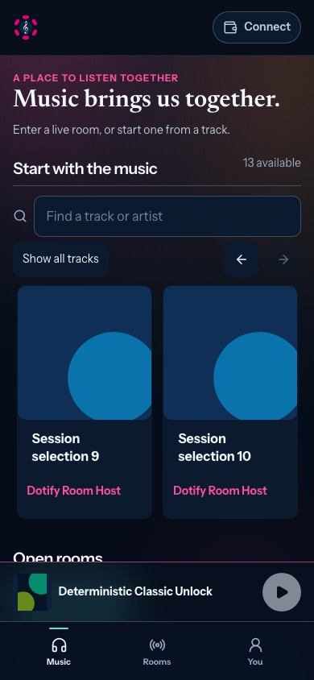
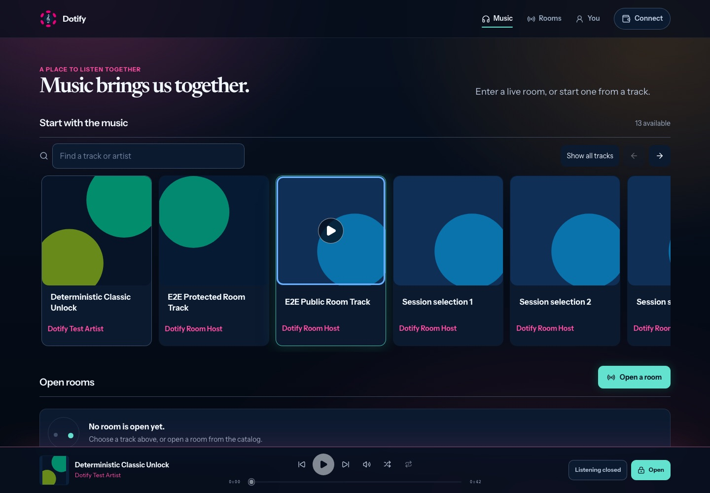
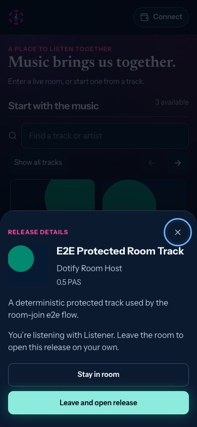
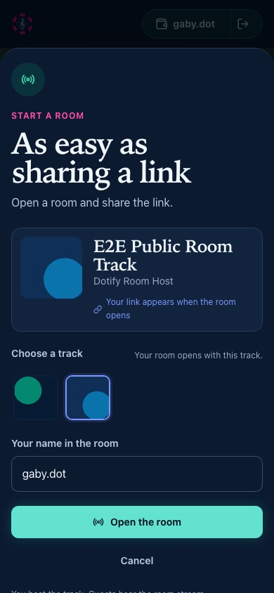

# Clear covers and a personal connection

Follow-up to [the interface audit](clear-musical-interface-2026-09-15.md), based
on the user's 19:26 Product Mobile recording. Base: `origin/dev` at
`8ff75de4a61269c4bf1f353f2b11c670ba7d5a1b` (merged #169, successful required CI).
Branch: `fix/catalog-play-and-host-identity`.

## Changes

The recording showed a persistent cover overlay on touch and arrows on
protected releases. Those arrows described an internal access branch but looked
like carousel navigation. Every cover now uses the same Play symbol. Mouse
hover reveals only that cover's control; keyboard focus reveals its control too.
On touch, covers remain clear while swiping. Tapping still starts the existing
listening action. The row navigation arrows stay in their own toolbar.

Catalog cards contain the cover, title and artist. Prices and eligibility text
move to the existing player/access screen; nothing can charge automatically.
Artist releases put their access terms and description inside **About this
release**. Room guests retain a read-only release sheet: inspecting a track
never switches their source or asks for its key. Leaving the room to open a
release remains explicit.

This is progressive disclosure, not a change to access policy. A Play symbol
expresses listening intent. For a protected track the accessible label still
says **View listening options** and the current policy check remains decisive.

## Polkadot account names

The installed SDK (`@parity/product-sdk` 0.27.0, host 0.19.1) exposes
`getAccountsProvider().getUserId()` with `primaryUsername`. This is the user's
name; `ProductAccount.dotNsIdentifier` is the application's identifier and must
not be used as their name. Checked against the installed source and the official
[host reference](https://paritytech.github.io/product-sdk/api/host/) and
[identity permission behavior](https://paritytech.github.io/product-sdk/api/signer/).

An explicit **Use Polkadot app** connection first acquires the app account. A
separate optional profile read then updates the account pill, account details
and You screen. Its permission prompt does not hold the connection in a pending
state. Denial, unsupported APIs, invalid values or a timeout retain a saved
account alias or short address. Each new connection gets a fresh read; stale
answers cannot update a newer connection, including a reconnect to the same
address. The existing 42-second host deadline also bounds this optional read.

The shared username seeds a new room's editable name. A saved wallet-scoped
alias takes precedence. A profile response cannot replace text being edited or
silently rename someone in a live room. Switching accounts clears the previous
account's seed; disconnecting returns to the independent guest identity.

Names are sanitized as display text, never treated as an attestation, address,
signer or access credential. No username is persisted or broadcast merely by
connecting. The existing room submission/rename actions persist the name the
person actually accepts. Names refresh on an explicit connection; changes made
inside the native host while continuously connected need a reconnect.

## Verification and remaining device checks

Automated evidence and final commands are recorded in the
[implementation evidence](../backlog/implementation/evidence/catalog-and-host-identity.md).
The host tests mount the real React app and installed SDK adapter against the
SDK's test host, through an e2e-only HTML entry. No production source imports
that fixture. These tests exercise display, input, refusal and stale-response
behavior; they do not certify a native identity-permission sheet or live signing.

Before native acceptance, open the tested build in Polkadot Mobile on the user's
iPhone: swipe the catalog to both ends, tap free and protected tracks, approve
and deny name sharing, check a remembered room alias, then reconnect another
account. Repeat with an attached keyboard if supported. Record the app version,
OS version and build SHA; browser WebKit is not a physical iPhone result.

## Captured browser states

Deterministic catalog artwork, rather than a live production catalog. These are
browser layout observations, not physical-device evidence.

