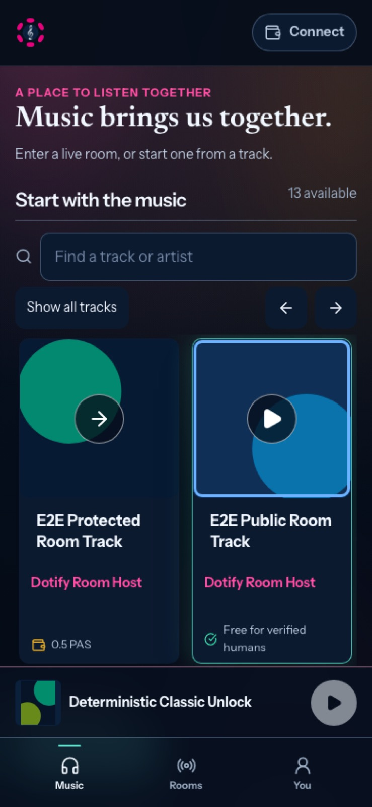
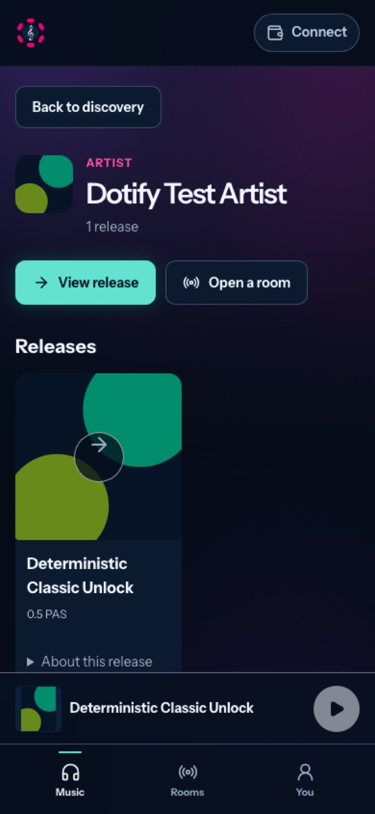
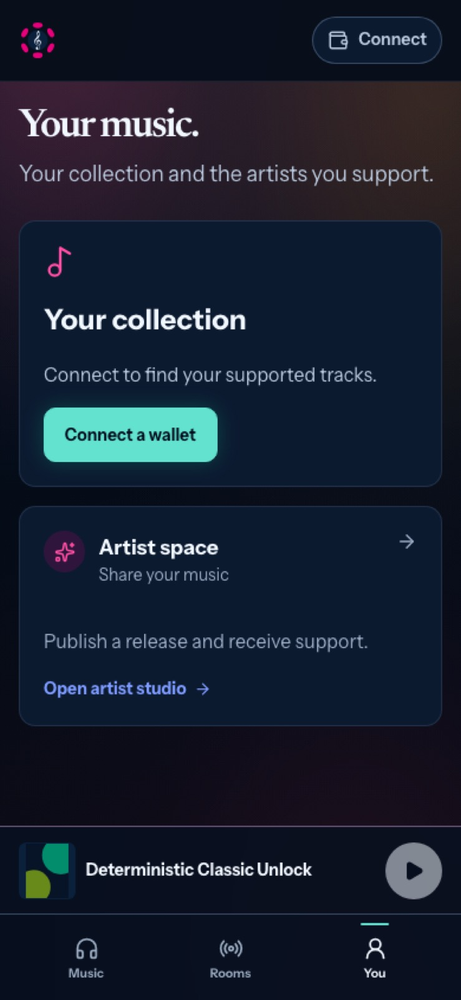

# A clearer musical interface

Date: 2026-09-15. Reviewed base: `dev` at
`c9583abc36afa1f86a2227ed482e94970bef5860` (#168).
Branch: `feat/clear-musical-interface`. Partial #151 and #90.

## Audit and benchmark method

This pass examines the supplied Dotify screenshots, the earlier user-supplied
Spotify player references, the current source and rendered Dotify journeys.
The comparison below uses current first-party product guides to verify interaction
semantics. It is a documented interface benchmark, not a claim of hands-on
subscription/device testing, an exhaustive competitor study or measured user
research. Competitor assets are not copied into the product.

| Reference and observed behavior | Useful principle | Dotify decision |
| --- | --- | --- |
| [Apple Music web playback](https://support.apple.com/en-gb/guide/music-web/apdm5cce24ab/web): a Play control appears over a song or album on hover. | Artwork should offer an actual, recognizable listening action. | A native cover button with a centered translucent Play affordance. Show it on hover/focus, always on touch. Protected/unavailable selections and room guests get a disclosure arrow with an accurate listening-options label instead. |
| [Spotify Now Playing](https://support.spotify.com/us/article/now-playing/): core transport is directly available, the mobile compact player expands, additional options use a secondary menu. | Preserve listening context while progressively disclosing secondary information. | Keep the existing persistent player and complete room transport. Remove repeated healthy status and product doctrine; retain actionable failure feedback. |
| [Spotify Jam](https://support.spotify.com/us/article/jam/): invite by link/QR, with explicit host participation controls. | Joining and understanding who hosts matter more than explaining transport infrastructure. | Room details lead with track, artist, host, presence and Join. Do not copy Spotify's subscription or shared-control rules; Dotify guests keep the existing host-authoritative stream. |
| [Bandcamp streaming](https://get.bandcamp.help/en/articles/15263360-what-are-streaming-limits-on-bandcamp): listening and purchase have distinct conditions. | Listening, supporting and access should have clear meanings. | Keep Dotify's own access policy and confirmation flow. Do not promise previews for protected tracks or imply that a payment record is verified listening access. |

These are design inferences from the cited behavior, not evidence that copying
any particular visual treatment improves a measured conversion rate.

## Findings and shipped decisions

| Finding | User impact | Change |
| --- | --- | --- |
| Rooms repeats “Guests arrive as people…” and “The host carries access”. | Adds reading without helping the next action. | Remove doctrine from the listening surface; architecture remains in repo docs and context-sensitive access explanations. |
| A healthy signal pill appears inside room details even after #168 removed it from the list heading. | Technical reassurance competes with joining and is not proof of audible sound. | Suppress normal status in both places. Keep connecting/offline/errors and refresh controls. |
| Orange live dots resemble warnings. | Room availability is ambiguous. | Green represents an online room connection, independent of play/pause; unavailable discovery is neutral. Text still names host/state. Two subtle pulses end within 4.8 seconds and respect reduced motion. No music energy is fabricated. |
| A screen-reader announcement has no `sr-only` CSS definition. | “Centered on…” becomes visible and overlaps the sky controls. | Add the missing semantic utility while retaining the live announcement. |
| An off-center headphone glyph is decorative, and a stretched title pseudo-element catches clicks across the card. | Click ownership is opaque and the affordance does not explain the action. | Explicit native cover button, centered translucent affordance, separate title and artist buttons. Preserve search/focus when returning. |
| Re-selecting an already loaded track pauses its source without necessarily triggering a new source-load autoplay. | A Play CTA could open a paused player. | The shell resumes a current ready source through the existing playback controller. New selections retain the catalog access check. |
| Leaving a room retains the guest transport role even after the remote stream is cleared. | An available Play action opens a disabled local player after leaving. | Reset the local transport role when the room is cleared; a regression checks that leaving stays silent, then explicit Play and seek work while the host room survives. |
| Artist profiles put generic explanation and an empty live panel before releases. | Music is buried under repeated positioning. | Releases immediately follow compact artist identity/actions; live rooms appear only when real rooms exist. Actual release description is disclosed on demand. |
| Artist verification and a handle are inferred from catalog metadata. | An address/published release is presented as verified identity. | Remove the unsupported badge, invented handle and generated biography. Keep the real artist name, releases and live presence. |
| Disconnected You repeats several empty panels and connection messages. | Makes a listener navigate infrastructure before there is useful personal content. | One collection invitation and a separate artist entry. Connected users retain support, wallet management and operator diagnostics. |
| Supported-track rows display a content hash and current catalog price as an amount paid. | Technical noise and an unsupported historical-payment claim. | Put artist/title first with a payment-record label. No receipt is invented from a content hash or current price. |

Text-size validation also exposed a pre-existing `20rem` minimum on `html` and
`body`: doubling text widened the entire document to 640px on a 390px screen.
The layout minimum is now a stable 320 CSS pixels; catalog and room-entry controls
wrap instead of forcing a wider page. The test traverses Music, Rooms, You and
artist at 200% text size. Wallet connection uses a wallet icon; disconnection
uses an exit icon, retaining explicit accessible names.

## Interaction contract

- The artwork button is a real keyboard/touch target, not an icon overlay that
  depends on clicking elsewhere. Its visible mark is at least 44 CSS pixels.
- A cache-backed playable label is a navigation hint, never authorization. New
  selections recheck access; room guests keep their existing listening authority.
- The current ready track resumes through the existing controller; it does not
  construct a second player. Clearing a room restores the local transport role
  instead of leaving the controls attached to the retired guest stream. Next/Previous and keyboard
  behavior from #168 remain in the regression suite.
- Stop perpetual decorative backdrop drift and card lift. Prefer neutral, legible controls around the artwork. Keep navy, cyan and pink;
  reserve green for room availability rather than reusing the orange presence
  token used elsewhere. Playback remains distinct from connection status.
- Essential errors, prices, consent and access conditions remain visible in the
  relevant flow. Removing an explanation is appropriate only when no decision
  depends on it.
- Artist metadata never silently becomes an identity guarantee. Payment records
  remain distinct from receipt amounts, recipient settlement and playable access.

## Visual evidence

Screenshots use deterministic test catalog artwork. These are actual Chromium
renders at 390 and 1440 CSS pixels; the enlarged-text case uses 200% root text.
The room capture uses the existing 2D fallback. No competitor assets are reused.

| Music on mobile | Artist on mobile | Personal collection on mobile |
| --- | --- | --- |
|  |  |  |

[Desktop music](images/clear-interface/music-1440.jpg) ·
[Desktop artist](images/clear-interface/artist-1440.jpg) ·
[Desktop You](images/clear-interface/you-1440.jpg) ·
[Room discovery](images/clear-interface/rooms-online.jpg) ·
[Enlarged text](images/clear-interface/artist-large-text.jpg)

## Boundaries and next slices

No deployment, migration, new dependency, wallet permission, signature, contract,
content-key, room protocol, history collection or nearby/queue integration.
Ordinary web and Product bundles must both build. Physical iPhone, native Product
host, real-wallet payments and full assistive-technology testing remain explicit
acceptance work; browser emulation is not device certification.

Recommended review units in this coherent PR: (1) catalog action semantics and
presence/status cleanup, (2) artist/You hierarchy and truthful labels. A later PR
can improve support receipts and publishing recovery once their technical
dependencies are verified. Queue/galaxy/nearby expansion remains separate.

Final test results and screenshots are recorded in the PR and implementation
evidence alongside this audit.
