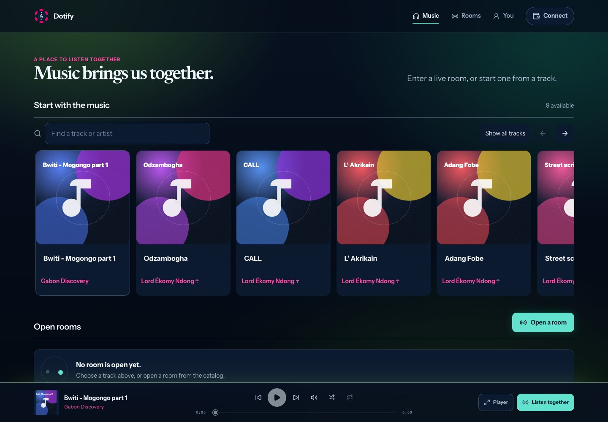
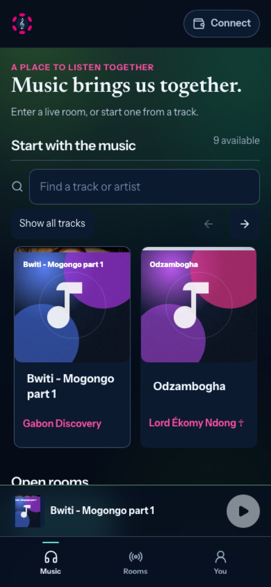
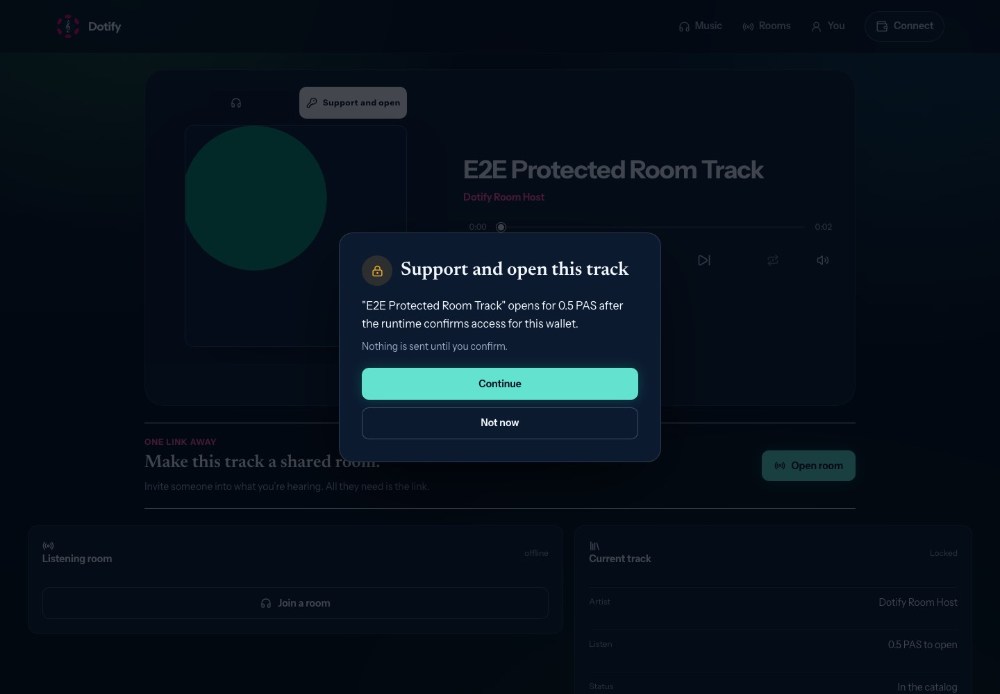
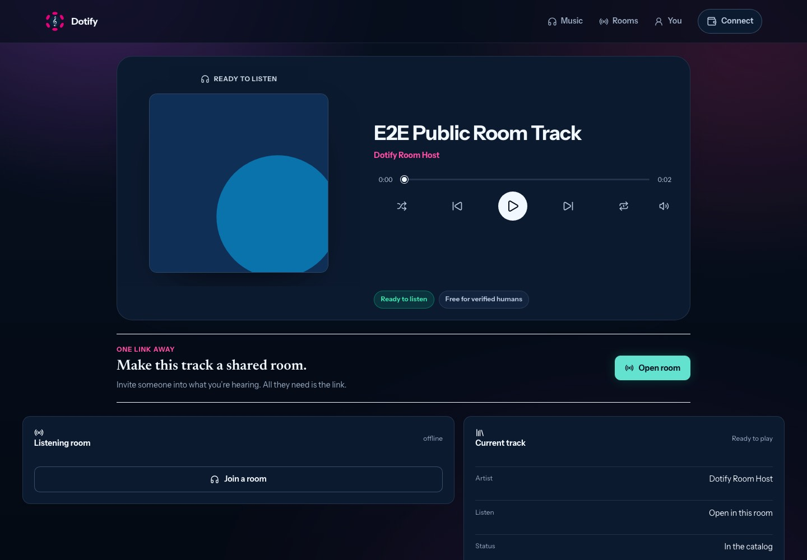
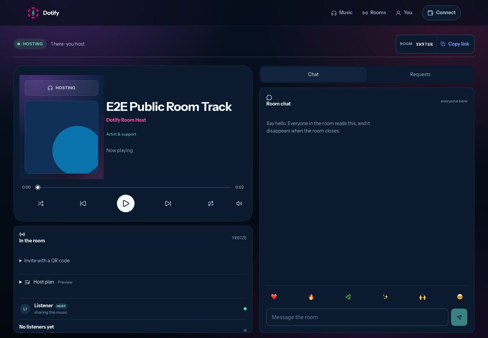
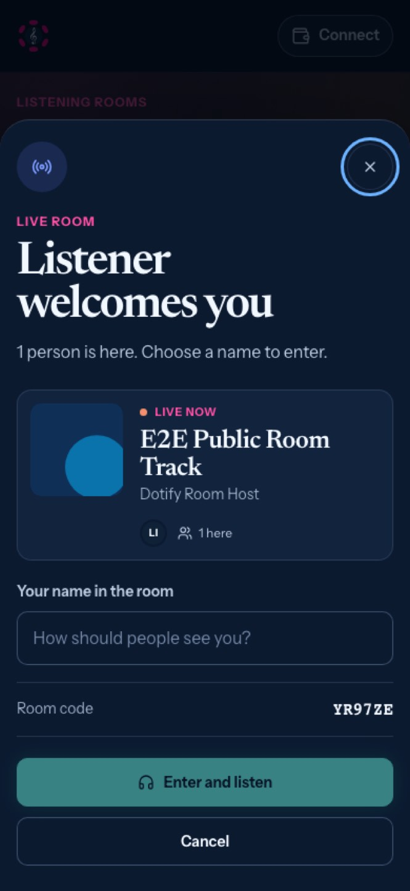

# UX, visual design and aesthetic audit

Date: 2026-09-17. Reviewed base: `dev` at
`ecdac986974488ff17dcd00e1ac03288e190f380` (#175), rendered from a local dev
server. Follow-up tickets: #176 (W21), #177 (W22),
#178 (W23), #179 (W24), #180 (W25), #181 (W26, Later). Cover evidence was added
to #87.

## Method and limits

Rendered with Chromium (Playwright) at 390x844 and 1440x1000 CSS pixels:

- the live catalog (9 releases, 3 directory artists), read-only through the
  production catalog endpoint, for artwork, titles and real content density;
- the deterministic e2e fixtures (`VITE_E2E_*`) for the solo player, support
  dialog, wallet sheet, host and guest rooms (two browser contexts over a local
  signaling server), You, and artist onboarding/publishing.

Additional measurements: computed font sizes, effective opacity and target
sizes of visible elements; token contrast ratios; stylesheet statistics; cover
transfer size and latency (one sample per cover, one network).

Limits: no physical device, native Product host, screen reader, user research
or p75 performance sample. The optional galaxy renderer was enabled only in the
fixture build; production keeps the 2D list by default. Fixture artwork is
synthetic. Earlier reviews
([premium experience](premium-experience-review-2026-09-15.md),
[clear musical interface](clear-musical-interface-2026-09-15.md),
[catalog and host identity](catalog-and-host-identity-2026-09-15.md)) were read
first; this audit records only what is still visible after #167-#175.

## Owner decisions recorded on 2026-09-17

- **Access cue on cards (amends #170).** Catalog and release cards get one
  discreet text line under the artist (for example `Free`, `Verified humans`,
  `0.5 PAS`). Nothing is drawn over the cover and touch covers stay clear while
  swiping. The line is a hint; opening a release still rechecks access.
- **Touch Play overlay stays removed.** #170 intentionally removed the
  persistent overlay on touch; this audit does not reopen it.
- **French localization is Later** (#181), outside the current execution batch.

## Reconciliation with the existing backlog

| Finding | Existing coverage | Action |
| --- | --- | --- |
| UX-01 Heavy, slow original covers | #87 responsive cover pipeline; W08 placeholder budget | Evidence comment on #87; placeholder presentation in #176 |
| UX-02 to UX-06 First listening screen | #90 principles only; #170 price decision | New #176 (W21), amends #170 per owner decision |
| UX-10 to UX-15 Hosting and joining | #151 W10 baseline; premium review PR 3 (recommended, never ticketed); #160 galaxy | New #177 (W22); galaxy items complement #160 |
| UX-20 to UX-23 Player and support wording | #90 vocabulary; #143 W04 and #156 W12 truth rules | New #178 (W23) preserving W04/W12 decisions |
| UX-30 to UX-36 Artist workspace | #156 W12 acceptance not met in rendered UI; #143 W04; #169 precedent; premium review PR 6 | New #180 (W25) |
| UX-40 to UX-46 Visual system | #151 W10 tokens; premium review PR 5 (recommended, never ticketed) | New #179 (W24) |
| UX-50 English-only interface | Not tracked | New #181 (W26), Later |

## Findings

### First listening screen (#176, W21)

- **UX-01 Covers.** Originals range from 61 KB to 2.2 MB and took 4.9-6.7 s each
  through `gateway.pinata.cloud`; `paseo-ipfs.polkadot.io` did not answer from
  the test network. The W08 1.2 s budget therefore shows placeholders on almost
  every cover of a first visit. Variants stay in #87.
- **UX-02 Dead dock control.** The persistent dock shows a preselected track
  whose Play button is `disabled` on first render
  (`web/src/components/PlayerDock.tsx`, `canUseTransport` in
  `web/src/hooks/usePlayback.ts`), while neighbouring controls look available.
- **UX-03 Access discovered by interruption.** Cards carry no access cue.
  Opening a protected release opens the player and immediately raises the
  support dialog. See the owner decision above.
- **UX-04 Placeholder duplication.** The generated placeholder embeds the title
  (`web/src/features/catalog/coverArtwork.ts`), duplicating the card title, and
  late images paint progressively over it.
- **UX-05 Display hygiene.** Titles keep double spaces (`Bwiti -  Mogongo part 1`);
  a directory artist with zero releases is listed under its raw address.
- **UX-06 Artist profile.** The primary action `View release` does not say which
  release; the artist name repeats on every card of the artist's own page.

### Hosting and joining (#177, W22)

- **UX-10 Role rendered as a name.** `DEFAULT_DISPLAY_NAME = 'Listener'`
  (`web/src/features/identity/walletIdentity.ts`) and the initial state in
  `web/src/hooks/useSession.ts` produce `Listener welcomes you`,
  `LISTENER HOSTS` and `Listener HOST` for a host who did not type a name.
- **UX-11 Repetition in the host room.** The room code appears three times and
  `HOSTING` twice; the cover sits in an offset tinted frame beneath a state pill.
- **UX-12 Invitation is secondary when alone.** A small `Copy link`, a QR inside a
  disclosure, and `Host plan · Preview` jargon (`web/src/components/HostLineup.tsx`).
- **UX-13 Guest controls.** Guests see disabled shuffle, previous, next and repeat
  plus a large play control; their own chat messages align like everyone else's.
  #167 correctly avoids faking host modes; the remaining issue is noise.
- **UX-14 Rooms page as dashboard.** Metric blocks (`web/src/views/RoomsView.tsx`),
  manual Refresh on a live socket view, a truncated monospace placeholder,
  competing primary actions, renderer toggle and Refresh in the empty state; the
  galaxy shows map controls and an oversized instruction for a single room.
- **UX-15 Join sheet.** `Live now` uses an orange dot
  (`web/src/components/JoinRoomModal.tsx`) against the green availability
  decision; initial focus lands on Close rather than the name field.

### Solo player and support (#178, W23)

- **UX-20 Dashboard tail.** Below the player card: `Listening room` with `offline`,
  and `Current track` with `Status: In the catalog`, `Listen: Open in this room`
  and `Browse music` (`web/src/views/PlayerView.tsx`). These panels use a wider
  grid than the card. `One link away` invites hosting even for a locked release.
- **UX-21 Status twice.** `READY TO LISTEN` above the cover and a
  `Ready to listen` chip; a large empty gap separates controls from chips.
- **UX-22 Support dialog.** `"…" opens for 0.5 PAS after the runtime confirms
  access for this wallet.` (`web/src/features/access/accessPromise.ts`) is shown
  to a disconnected visitor; `Continue` does not name the action; recipients are
  absent at this step. `Nothing is sent until you confirm.` is good and stays.
- **UX-23 Wallet sheet.** `Listen first. Connect only when a paid, protected, or
  artist action needs it.` appears even when opened from a paid action, followed
  by `Use EVM wallet` (`web/src/components/WalletModal.tsx`).

### Artist workspace (#180, W25)

- **UX-30 Unverified claims.** The studio still shows a `Verified artist space`
  badge and a generated `@handle` (`web/src/views/artist/ArtistConsole.tsx`),
  both removed from the public profile by #169. `Your catalog cannot be quietly
  taken down or re-listed without you` overstates control: audio is pinned
  through the operator's storage account and listed through Dotify's indexer.
  The access sentence omits Free (`web/src/views/artist/OverviewTab.tsx`).
- **UX-31 Run-on text.** On mobile the sovereignty list renders
  `You hold the keysYour catalog cannot…`.
- **UX-32 Jargon.** Runtime, registry transaction, catalog read-back, IPFS
  canonical manifest, Bulletin archival and controller are primary vocabulary.
- **UX-33 Triple repetition.** The same facts appear in the review table,
  `Before you publish`, and the confirmation dialog; review rows are very tall
  with wrapping labels.
- **UX-34 Onboarding order.** `Dotify Artist` is pre-filled (`web/src/App.tsx`,
  `web/src/views/ListenerShell.tsx`); manifesto and consent precede the steps; the
  consent checkbox is unthemed; `Create artist profile` is disabled without a reason.
- **UX-35 Split wording.** `80% across 1 holder(s)` plus `Artist remainder 20%
  also returns to` the same address makes a single-recipient release look split.
- **UX-36 First studio screen on mobile.** Three large zero-value metric cards, a
  truncated tab strip without a scroll cue, duplicate publish actions.

### Visual system (#179, W24)

- **UX-40 Type scale.** 78 distinct `font-size` declarations across 16 stylesheets,
  including 0.66, 0.68, 0.6875 and 0.75rem; three display voices (Newsreader
  editorial, tight sans titles, oversized serif in onboarding/console) without a
  rule; tight tracking makes large letters touch. Tokens define only
  `--text-xs` to `--text-xl`.
- **UX-41 Small text.** Dock time labels render at 9.9 px in `SFMono-Regular`
  (Apple-only first family); mobile navigation labels at 10.6 px.
- **UX-42 Color roles.** Token contrast is strong (ink 16.3:1, muted 7.5:1 and
  cyan 11.0:1 on `--surface`; pink 5.7:1). The problem is usage: pink colors every
  artist name, eyebrow and several icons; the blue signal color doubles as a
  link color; live state is orange in the join sheet and green elsewhere.
- **UX-43 Glyph fallback.** `☥` (U+2625) in `Lord Ékomy Ndong ☥` is missing from
  Instrument Sans; at small sizes the fallback reads like a dagger, inverting its
  meaning. Verify on iOS, Android and the Product host.
- **UX-44 Components.** Unthemed checkbox, heavy bordered back button, nested empty
  cards in You, status text below action buttons, filled versus outlined play icons.
- **UX-45 Composition.** Music and Rooms hero taglines float away from their titles;
  onboarding feature descriptions start at three different x positions.
- **UX-46 Stylesheet accretion.** 9,700 lines; later override sheets
  (`clear-interface.css`, `discovery-focus.css`, `player-presence.css`,
  `responsive.css`) sit on earlier rules.

### Language (#181, W26, Later)

- **UX-50** The interface is English-only (`<html lang="en">`) while the current
  catalog and pilot community are largely francophone.

## Keep

Night Console identity and restrained aura; no horizontal overflow; 44 px targets
on most controls; the guest threshold sheet (preview, code, name, enter); compact
mobile player and room chat; `Nothing is sent until you confirm.`; explicit
publication confirmation.

## Execution order

W21 → W22 → W23 → W25 → W24. W24 consolidates styles after the structural and
wording changes to avoid migrating rules that are about to disappear. W26 waits.

## Captures

| First visit, desktop | First visit, mobile | Support dialog |
| --- | --- | --- |
|  |  |  |

| Player tail | Host alone | Guest threshold |
| --- | --- | --- |
|  |  |  |

[Guest room](images/ux-design-audit-2026-09-17/guest-room-390.jpg) ·
[Wallet sheet](images/ux-design-audit-2026-09-17/wallet-sheet-390.jpg) ·
[Rooms with galaxy](images/ux-design-audit-2026-09-17/rooms-galaxy-1440.jpg) ·
[Artist onboarding](images/ux-design-audit-2026-09-17/artist-onboarding-1440.jpg) ·
[Artist console, mobile](images/ux-design-audit-2026-09-17/artist-console-390.jpg)

Full-page captures can show sticky headers or the skip link at their scroll
position; those are capture artifacts, not findings.
