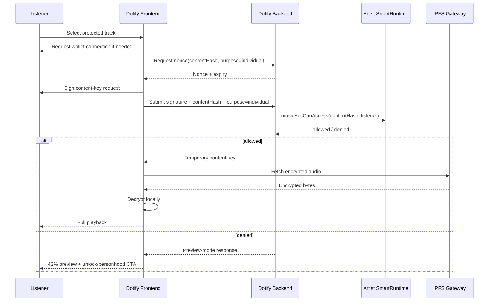
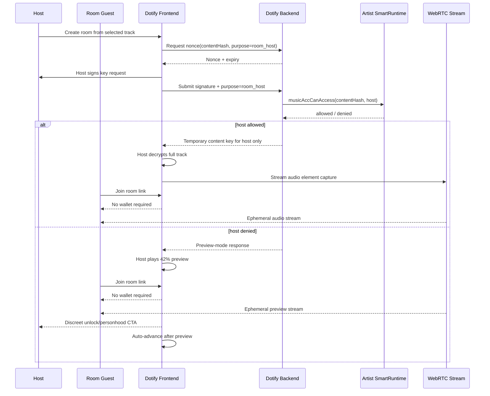
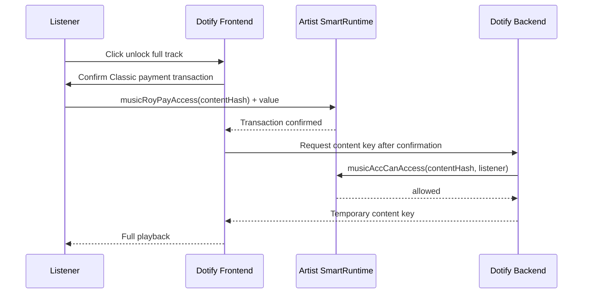
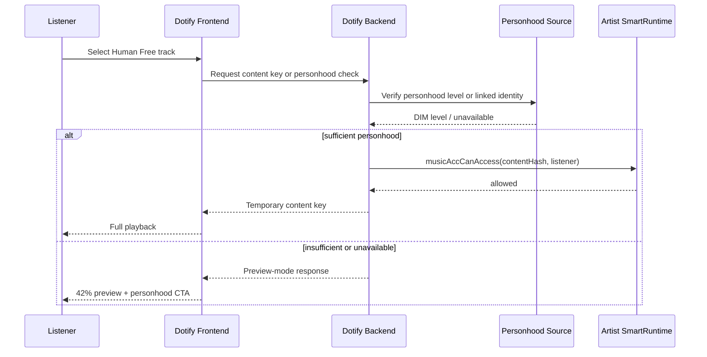
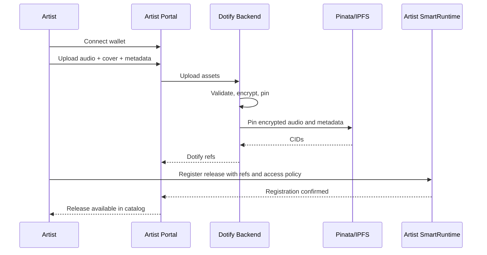

# Dotify UX signature flows

## Purpose

This document defines when Dotify should ask users to connect a wallet, sign a message, or submit an on-chain transaction.

The guiding principle is:

> Sign rarely, verify often.

Dotify must avoid wallet pop-up fatigue. Wallet prompts should appear only when they protect a meaningful boundary: full individual playback, host full-stream access, payments, artist publishing, or runtime ownership actions.

## UX rule summary

| Context | Wallet required? | Signature required? | Transaction required? |
| --- | --- | --- | --- |
| Browse catalog | No | No | No |
| Play preview | No | No | No |
| Join room as listener | No | No | No |
| Listen to host stream | No | No | No |
| Individual full playback | Yes | Yes, off-chain key request | Only if access requires payment |
| Room host full playback | Yes | Yes, off-chain key request | Only if access requires payment |
| Classic unlock | Yes | Maybe session signature + payment tx | Yes |
| Human Free unlock | Yes | Maybe session signature | No, unless proving/linking personhood requires one |
| Artist publishing | Yes | Yes/transaction depending on step | Yes for runtime/register actions |

## Individual playback flow

## Room playback flow

## Classic unlock flow

## Human Free flow

## Artist publishing flow

## UX principles

- Browsing must never require a wallet.
- Preview playback must never require a wallet.
- Room listening as a guest must never require a wallet.
- Full individual playback requires access verification.
- Full host room playback requires host access verification.
- Money movement still requires an explicit wallet transaction.
- Artist publishing must be explicit and reviewable.
- Dotify should prefer one session-level off-chain signature where feasible, not a signature per track.

## Non-goals

- Do not claim that WebRTC streams cannot be recorded.
- Do not give room guests content keys.
- Do not make social listening feel like an authentication ceremony.
