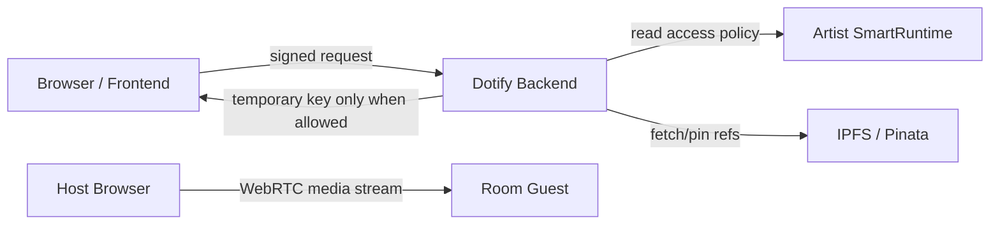
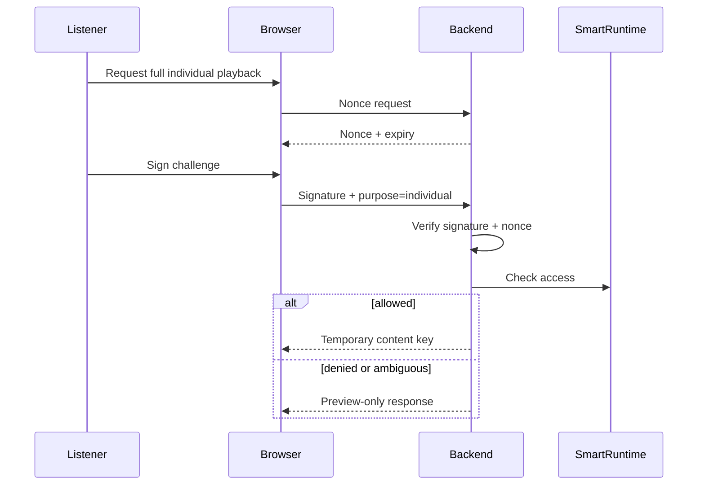
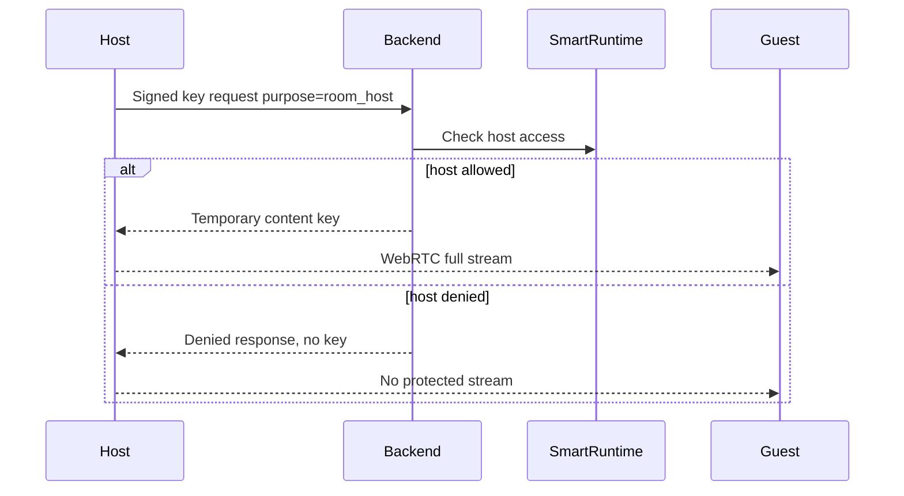

# Dotify content-key delivery threat model

## Purpose

This document defines what Dotify's content-key delivery protects, what it does not protect, and which boundaries must be preserved during implementation.

Dotify should be honest: this is protected distribution access, not absolute DRM.

## Assets to protect

- Full encrypted audio source files.
- Per-track content keys.
- Backend master secret or key derivation material.
- Pinata upload credentials.
- Wallet-signature challenge integrity.
- Access-policy correctness.
- Artist runtime trust assumptions.

## Actors

| Actor | Description |
| --- | --- |
| Artist | Publishes protected tracks and defines access policy. |
| Listener | Requests individual playback or joins a room. |
| Host | Streams audio into a room. |
| Room guest | Receives WebRTC stream from host. |
| Backend | Validates signatures, checks runtime access, delivers keys. |
| Attacker | Attempts to obtain source files, keys, or replay access. |

## Trust boundaries



## Core security rules

- Production content keys must never be bundled into the frontend.
- Pinata credentials must not be exposed in Vite frontend variables.
- Backend must verify wallet signatures server-side.
- Signed challenges must include content hash, requester address, purpose, chain ID, nonce, and expiry.
- Nonces must not be replayable.
- Backend must check `musicAccCanAccess` before key release.
- Backend must fail closed on RPC/access ambiguity.
- Room listeners must never receive content keys.
- Room listeners must never receive encrypted source files through the key-delivery path.

## Individual playback threat model



### Threats

| Threat | Mitigation |
| --- | --- |
| User extracts frontend bundle | No production key material in bundle. |
| Replay old signature | Nonce and expiry, one-time use. |
| User lies about access | Backend ignores frontend access booleans and reads runtime. |
| RPC unavailable | Fail closed for key release. |
| Leaked temporary key | Keep key scoped to track/session; rotate strategy later. |

## Room playback threat model



### Key point

The host may receive a content key if authorized.

Room guests do not receive a key. They receive only the WebRTC media stream.

### Threats

| Threat | Mitigation / boundary |
| --- | --- |
| Guest tries to fetch source file | Guest has no content key and no key request path. |
| Guest records WebRTC stream | Not prevented. This is outside Dotify's distribution-access protection. |
| Unauthorized host tries protected track | Backend returns a denial response, no key, and the host streams no protected audio. |
| Host shares decrypted audio outside Dotify | Not fully preventable once host is authorized. Document boundary. |
| Malicious client claims purpose=room_host for guest | Signature requester is checked; room listeners are not given key-delivery UI/path. |

## Non-DRM statement

Dotify does not promise that audio cannot be recorded after playback.

Dotify protects access to full source files and content keys. It does not prevent analog capture, screen/audio recording, or redistribution by an authorized malicious host.

Do not describe Dotify as perfect DRM.

## Access modes and the retired preview boundary

Access model v2 (ticket 24) gives every track an artist-chosen mode:

- `free`: the key service releases the content key with no authentication
  (POST /free-key). The backend still verifies the mode on-chain first
  (musicAccCanAccess probed with the zero address), so a track flipped back to
  a gated mode stops being served immediately. Encryption of free tracks is a
  policy hinge, not secrecy: the artist can change the door later without
  re-uploading, and IPFS never holds clear audio.
- `classic` (paid) and `human-free` (Proof of Personhood): wallet-signed key
  requests with the on-chain check, unchanged.

The 42% preview assets (ticket 18) are retired: denials no longer carry a
degraded playback mode - an unauthorized listener gets a reason plus an unlock
CTA and no audio. Already-pinned manifests may still carry `previewCID`; the
field is ignored and no new manifests produce it.

## Session auth: sign once, listen freely (ticket 24 P2)

One SIWE-style SIGN_IN signature (nonce + expiry + replay protection, same
fail-closed order as key requests) exchanges for a bearer session token
(~24h). Later key requests carry the token instead of a fresh signature.

Properties and boundaries:

- The token proves identity only. Every key request still runs the on-chain
  access check for its own track against the token's address - a token never
  grants access by itself.
- Tokens are HMAC-SHA256 over a strict two-claim-shape payload; the HMAC key
  is HKDF-derived from CONTENT_KEY_MASTER_SECRET with a dedicated info label,
  so token keys and content keys never share bytes and no new secret exists.
- A stolen token is bounded by TTL, server-side revocation (logout, also
  triggered by wallet disconnect in the app), and the fact that it can only
  fetch keys the address could already obtain.
- Revocation is an in-memory jti blocklist: process-lifetime, matching the
  single-instance deployment. Scale-out needs a shared store first.
- If the master secret is unconfigured, session auth returns 503 and clients
  fall back to the per-request signed path (fail closed, never open).

## Logging rules

Never log:

- content keys;
- master secrets;
- Pinata JWTs;
- raw audio bytes;
- full signed challenge payloads if they include sensitive session data.

Safe to log:

- content hash;
- request purpose;
- requester address;
- access result;
- reason codes;
- correlation IDs.

## Reason codes

Suggested reason codes:

```ts
type KeyRequestReason =
  | 'ACCESS_ALLOWED'
  | 'LISTENER_ACCESS_REQUIRED'
  | 'HOST_ACCESS_REQUIRED'
  | 'PAYMENT_REQUIRED'
  | 'PERSONHOOD_REQUIRED'
  | 'INVALID_SIGNATURE'
  | 'EXPIRED_SESSION'
  | 'NONCE_REPLAYED'
  | 'RPC_UNAVAILABLE'
  | 'RUNTIME_NOT_FOUND'
  | 'TRACK_NOT_FOUND';
```

## Review checklist

Before merging key-delivery changes, verify:

- frontend bundle has no production key material;
- backend verifies signatures;
- nonce replay is rejected;
- chain access is checked server-side;
- room listener key path does not exist;
- unauthorized host receives a denial response and no content key;
- docs do not claim absolute DRM;
- tests cover denied, allowed, replay, and RPC failure paths.
