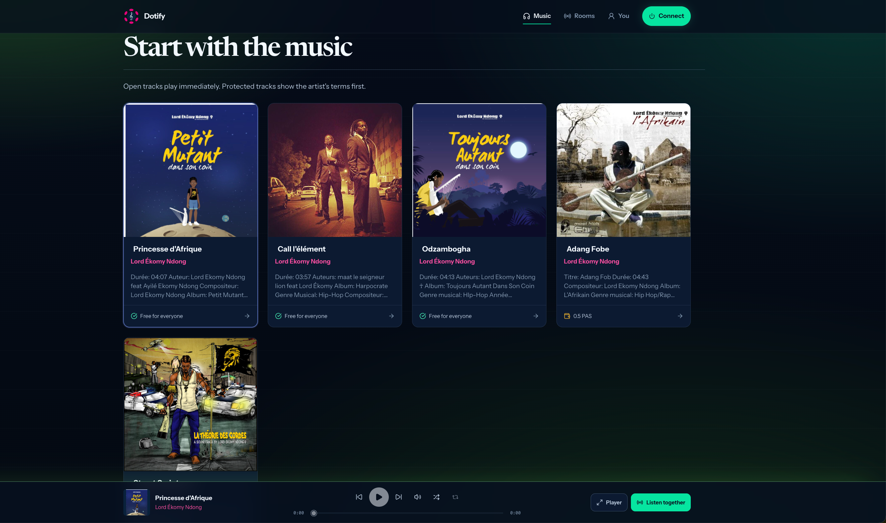
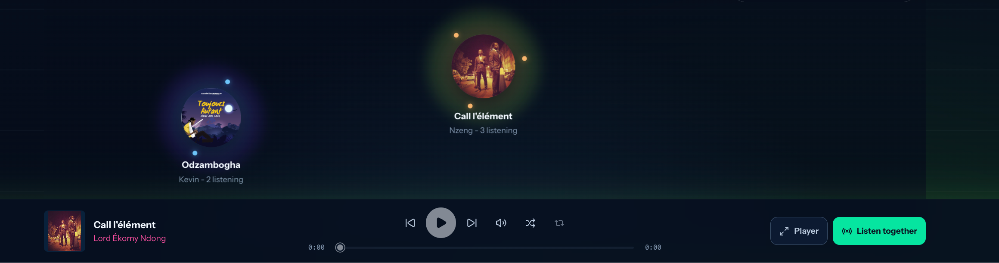
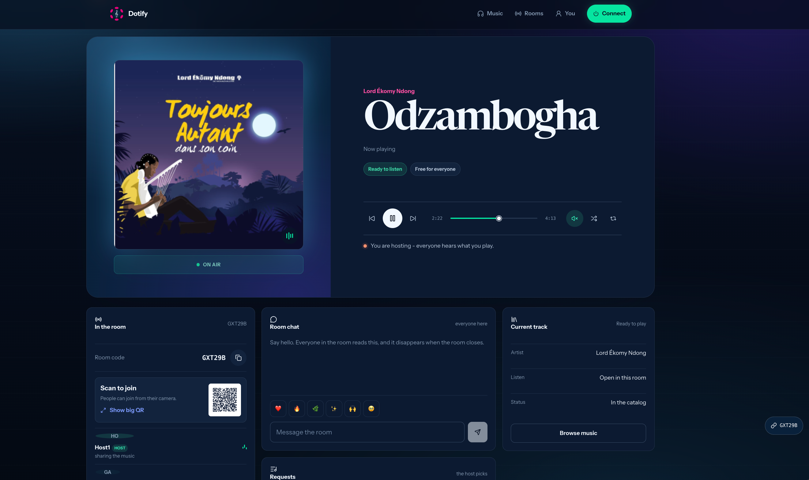

# README changes for `dev`

Five targeted edits. Everything else in the current README stays as it is - the technical sections are accurate.

---

## 1. Replace the top block

Replace everything from `# Dotify` down to (and including) the paragraph ending `web/src/styles/aura.css`).` with:

````markdown
<p align="center">
  
</p>

# Dotify

**Let the Music connect the dots.**

Buses, trains, waiting rooms, streets: our common spaces have become places
where solitudes sit side by side, each person inside their own bubble. Humanity
has never been so connected, and rarely so alone. Yet inside almost every
bubble the same thing is happening - people are listening to music.

Dotify builds bridges out of that shared gesture. It is a shared common
listening space that turns common spaces into **spaces of commons**, where
music is treated as a cultural commons and shared presence is the experience.

The same protocol gives artists sovereignty over their work. Each artist gets a
personal smart space, a contract based runtime that returns full control over
distribution, authorship, access and value flows, with support split
automatically between rights holders. Fewer intermediaries between an artist
and their public, and a higher valuation of their work.

The current interface direction is documented in
[Dotify Shared Score](docs/design/dotify-shared-score.md), amended by the
Living Light addendum: the Shared Score structure and honesty rules stay, and
the presentation is an immersive dark listening room where the active track's
aura lights the whole field (`web/src/styles/aura.css`).
````

---

## 2. Add a Screenshots section

Insert directly after the `## What it does` list, before `## Path chosen`:

````markdown
## Screenshots

**Catalog** - releases published by the artists themselves, each carrying the
access mode its artist chose at upload. Any track can be opened as a room.



**Listening rooms** - open rooms appear as a galaxy. Every halo is a listening
moment happening right now; discovery starts from someone listening rather than
from a feed.



**Inside a room** - one shared player, a room chat and emoji reactions that live
only as long as the room, and track requests the host decides on.


````

---

## 3. Fix the catalog line in "What works"

Find:

```
- Seed catalog with five tracks browsable on the Music view.
```

Replace with:

```
- Seed catalog browsable on the Music view.
```

(Same edit applies to the `## What it does` bullet that says "then a finite
catalog" if you want the wording consistent - suggested: "then the catalog".)

---

## 4. Add a Roadmap section

Insert before `## Improvement Backlog`:

````markdown
## Roadmap

In order:

1. **Full portability to Product DevNet** - the same shared listening
   experience carried natively by the Product host, so Dotify never becomes
   another silo.
2. **Subscription as commitment** - a staking based subscription: the monthly
   amount is staked and the yield goes to the artists. Leaving gives the money
   back, so subscribers become real supporters and investors rather than
   customers.
3. **Ambassador program** - listeners act as cultural ambassadors for the
   artists they love, and artists can choose to reward that transmission.
4. **Decentralised music awards** - recognition decided by the community, with
   results anyone can audit.
````

---

## 5. Add brand and presentation rows to "Structure"

In the `## Structure` table, add:

```
| `brand/`           | Logo, lockups, app icons and favicons                  |
| `docs/images/`     | Product screenshots used in this README                |
| `docs/presentation/` | Project presentation deck (PDF)                      |
```
